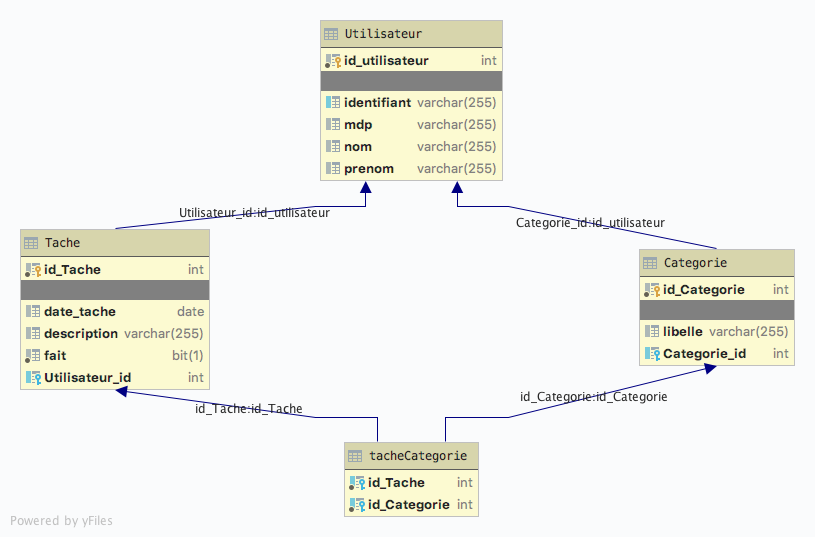

# ToDoList

-----

## TP TODO

### [lien Github :](https://github.com/arnaudENI/ToDoList.git)

### Partie 1 : La couche DAL avec JPA

Nous voulons faire une application de gestion de tâches (TO DOs). L'application devra respecter les exigences suivantes :
- Un utilisateur est une personne dont on connait le nom, le prénom, un identifiant de connexion et un mot de passe
- Un utilisateur identifié peut lister les tâches à faire pour un jour donné
- Un utilisateur identifié peut ajouter une tâche pour un jour donné. Une tâche est décrite obligatoirement par une description (250 caractères maximum), par une date, par un état : A faire ou fait et par une liste de catégories définie par l'utilisateur
- La liste des catégories est spécifique à chaque utilisateur.
1) Décrivez avec un diagramme de cas d'utilisation les fonctionnalités proposées par votre future application
2) Décrivez avec un diagramme de classe le modèle de données objet de l'application. Vous pouvez utiliser les stéréotypes «Entity», «Id», … pour préciser votre diagramme
3) Pour cette première partie, vous développerez la couche DAL de l'application en utilisant JPA, ainsi qu'une application (classe java contenant une méthode main) permettant de vérifier le fonctionnement de l'application.
Vous déposerez les différents livrables (diagrammes, projet) sous le canal « Java avancé – Utiliser les frameworks », dans la section Fichiers, dans le répertoire du groupe.

## Diagramme use-case

## Diagramme MERISE
### MCD

### MLD

## Diagramme Entity Relation

## Diagramme tables crees

