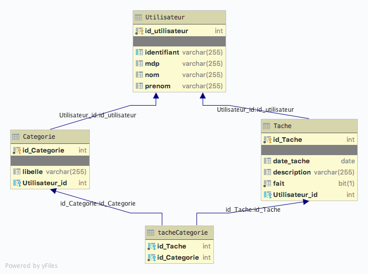

# ToDoList

-----

## TP TODO

### [lien Github :](https://github.com/arnaudENI/ToDoList.git)

### Partie 1 : La couche DAL avec JPA

Nous voulons faire une application de gestion de tâches (TO DOs). L'application devra respecter les exigences suivantes :
- Un utilisateur est une personne dont on connait le nom, le prénom, un identifiant de connexion et un mot de passe
- Un utilisateur identifié peut lister les tâches à faire pour un jour donné
- Un utilisateur identifié peut ajouter une tâche pour un jour donné. Une tâche est décrite obligatoirement par une description (250 caractères maximum), par une date, par un état : A faire ou fait et par une liste de catégories définie par l'utilisateur
- La liste des catégories est spécifique à chaque utilisateur.
1) Décrivez avec un diagramme de cas d'utilisation les fonctionnalités proposées par votre future application
2) Décrivez avec un diagramme de classe le modèle de données objet de l'application. Vous pouvez utiliser les stéréotypes «Entity», «Id», … pour préciser votre diagramme
3) Pour cette première partie, vous développerez la couche DAL de l'application en utilisant JPA, ainsi qu'une application (classe java contenant une méthode main) permettant de vérifier le fonctionnement de l'application.
Vous déposerez les différents livrables (diagrammes, projet) sous le canal « Java avancé – Utiliser les frameworks », dans la section Fichiers, dans le répertoire du groupe.

### Partie 2: L’application en Spring

Les deux objectifs de cette partie du TP sont:

- De **transposer** la partie **JPA en Spring Data** et **corriger les erreurs** vues sur la partie JPA

- De **développer** la **partie présentation** de l’application en utilisant Spring MVC.

- Une page de connexion 
    + **Si** la connexion est en **échec**, **on reste sur la page** de connexion **avec un message d’erreur**.
    + **Si** la connexion est **opérationnelle** arrivée sur la **page des tâches de l’utilisateur**
    + S’il a des tâches, les affichées dans un tableau (Il faut pouvoir mettre à jour l’état de la tâche ou la supprimer)
    + Si **aucune tâche**, un **message** indiqué à la place du tableau
        + Au-dessus du tableau, il ya:
            + Un moyen de **filtrer** selon la **date** des tâches ou selon la **catégorie**
            + Un **bouton ajouter une tâche**  qui **amènera** à la page du **formulaire de création d’une tâche**
                 Le formulaire de création d’une tâche doit permettre de référencer la date, le descriptif, l’état d’une tâche.
                 Et associée une à n catégories (vous pouvez afficher une combo-box à sélection multiples.)
            + Un **bouton ajouter une nouvelle catégorie** qui amènera à la page du formulaire de **création d’une catégorie**               
                On suppose que si l’utilisateur veut créer une nouvelle catégorie, il est passé par le formulaire création d’une nouvelle catégorie en amont
                Le formulaire doit gérer les exceptions
                En **sortie de la création d’une tâche**, on **revient sur la page des tâches** actuelles
                Le formulaire d’une nouvelle catégorie doit permettre de fournir un libellé qui est obligatoire et doit gérer les exceptions.
                En sortie de la création d’une catégorie, on revient sur la page des tâches actuelles
                
_Nous ne gérons pas dans cette partie du projet la vue avec l’ensemble des catégories et la mise à jour des catégories_
**N’oubliez pas que pour gérer tous les traitements, l’utilisateur doit être connecté.**

**Nous ne vous demandons pas d’internationalisation,ni une CSS évoluée.**

Nous voulons des **pages fonctionnelles avec gestions des erreurs** en Spring et des contrôleurs avec **gestions des validations**.
Vous **déposerez** les différents livrables (diagrammes, projet) sous le canal **«Java avancé –Utiliser les frameworks»**, dans la section **Fichiers**,
 dans le répertoire du groupe.
## Diagramme use-case

## Diagramme MERISE
### MCD

### MLD

## Diagramme Entity Relation

## Diagramme tables crees

